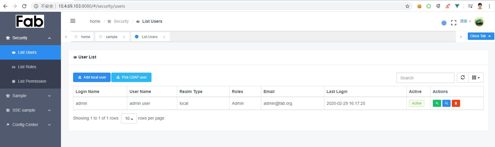
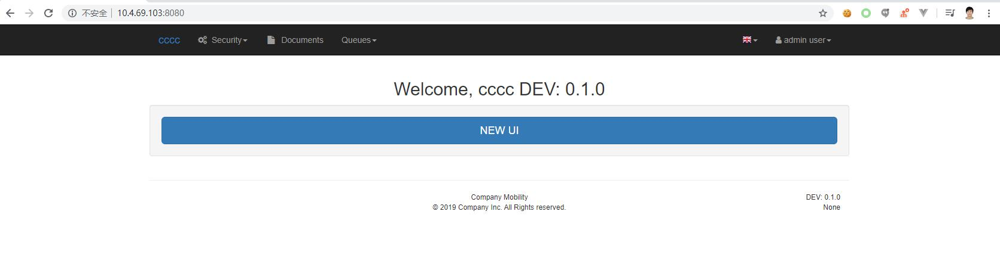

Fab-admin
==========

> A full stack Flask app generator based on [Flask-appbuilder](https://github.com/dpgaspar/Flask-AppBuilder),
> [Redis](https://redis.io/) and [VUE-IView]()

> [Guide doc](https://cw1427.github.io/fab-admin/)

What is it:
-----------

fab-admin is one app gererator based on flask-appbuild, it brings pure front-end structure based on VUE UI named
[IVIEW](http://iview.talkingdata.com).
It has several built-in commands to help generate a Flask app and be convinent for development.

## python-ldap windows wheel support

https://www.lfd.uci.edu/~gohlke/pythonlibs/#python-ldap

## release note

- v0.4.0 to add element plugin vue admin template

- v0.3.0 to setup py3.8 env compatable


# What is new

Setup Python runtime on Python3.8,  upgrade Sqlalchemy to 1.4,  Added new web template elepa.


## UI sample

### elepa (element pluss admin)

https://element-plus-admin-doc.cn/


### iview template UI a glance




> Easily switch between original UI and IVIEW

There is a switch link under the menu tree as below:




Features
--------

- Front-end based on VUE IVIEW
- Redis
- RQ (Redis Queue)
- Scheduler
- SSE (Server-Sent-Event)
- Docker
- LDAP
- UWSGI
- Bootstrap Table

Depends on:
-----------

- flask
- flask-appbuilder
- Redis
- Sqlalchemy
- RQ
- VUE
- IView-admin

# Deployment and Open source:

## Deployed it into pypi:  [fab-admin](https://pypi.org/project/fab-admin/)

## Deploy and install:

- python setup.py sdist --formats=gztar,zip

- Make it Public:
  
  - python setup.py sdist upload -r pypi
  - twine upload pypi

- docsify
  
  Running up dosify by command
  
  ```linux
  $ docsify serve ./docs/
  ```
