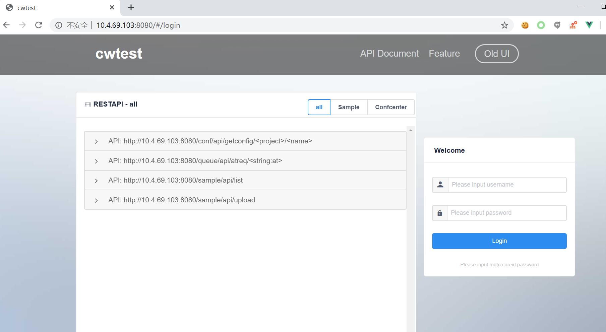

# Deploy sample app via uWSGI

fabadmin has wsgi-handler out-of-box, you can find uwsgi_host.ini file under docker folder. It is a sample
uwsgi config file, you can bring uWsgi up accordingly.

## uWSGI install

uWSGI is a very good WSGI server, it can easily serve fab-admin flask based app. And fab-admin has many useful backend
tasks depends on uWSGI task feature, please see the tasks module. Below is the uwsgi install command.


```linux
$pip install uwsgi==2.0.18
```

## Start uWSGI

There have two uwsgi ini files under docker folder, one is uwsgi.ini the other is uwsgi_host.ini. **uwsgi.ini** can be
used in docker which I will introduce later. **uwsgi_host.ini** we can use it to bring up uWSGI server in linux.

As default uWSGI would listen 8081, but the front-end compile would point to 8080(will explain front-end development).

```linux
$ uwsgi -i ./docker/uwsgi_host.ini --die-on-term
```

## Nginx web server

Nginx is a very popular web server, we can use it to serve our uWSGI app server. Fab-admin has nginx.conf file under docker
folder, please refer it to start up nginx. For more detail about nginx please see [Nginx](http://nginx.org/)




