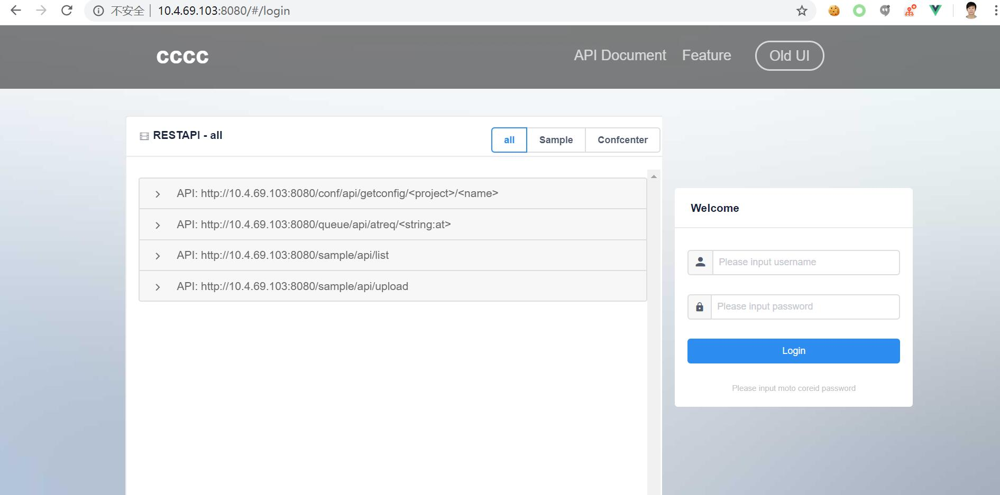
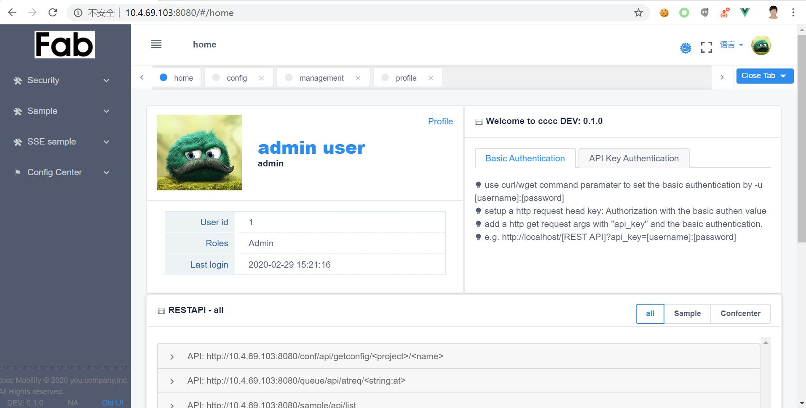

# Install

fab-admin based on python version >= 3.6.8

## Install fab-admin

> Befor install

fab-admin has dev, test and prod 3 kinds of execute mode. As default, it runs in dev and with sqlite3 dependency.
for test and prod mode, it needs mysqlclient to integrate with mysql. So it is better to prepare those module in your OS.

 - sqlite3

```linux
apt-get install sqlite3 libsqlite3-dev
```

 -  Mysql client library and python dev

```linux
apt-get install libmysqlclient-dev python-dev
```


 - use pyenv to reinstall python3.6.8

 If you forget to install sqlite3 lib before install python, you have to reinstall python3.

```python
    pyenv install 3.6.8
```


> install fab-admin from pypi

You can directly install fab_admin from pypi

```python
pip install fab-admin
```

## Init app

Once we have successfully install fab-admin (all of the dependencies have been installed), we can use start init your app.

### Check install

Prepare a empty folder, we can cd into it and run the fabadmin to check if it had been installed successfully:

```linux
(env3_6_8) ****@***:~/sandbox/cwtest$ fabadmin
```

Below are a part of the output
```linux
[2020-03-02 22:03:39,919] INFO 6723 [flask_appbuilder.security.sqla.manager] manager.py:384 - [shws4] - Added Permission menu access on AutoDocumentsView to role Admin
[2020-03-02 22:03:39,919] INFO 6723 [flask_appbuilder.base] base.py:276 - [shws4] - Registered AddOn: fab_addon_autodoc.manager.AutoDocManager
WARNING: Was unable to import app Error: No module named 'app'
There is no extend commands import Error: No module named 'app'
Usage: fabadmin [OPTIONS] COMMAND [ARGS]...

  A fabmanager CLI extension, to bring some useful command for fab_admin app
  clone

Options:
  --help  Show this message and exit.

Commands:
  babel-compile     Babel, Compiles all translations
  babel-extract     Babel, Extracts and updates all messages...
  clone             Clone a basic fab_admin app
  collect-static    Copies flask-appbuilder static files to your...
  create-addon      Create a Skeleton AddOn (needs internet...
  create-admin      Creates an admin user
  create-app        Create a Skeleton application (needs internet...
  create-db         Create all your database objects (SQLAlchemy...
  create-user       Create a user
  list-users        List all users on the database
  list-views        List all registered views
  reset-password    Resets a user's password
  run               Runs Flask dev web server.
  security-cleanup  Cleanup unused permissions from views and...
  ssehb             The heart beat command to check the invalid...
  syncauth          Try to sync fab auth structure data into...
  version           Flask-AppBuilder package version

```

### Clone fabadmin basic app

We will see a list of commands above, there is one command: fab-admin clone. As default it will help to initialize an app

As default fabadmin has the compiled front-end code with:  localhost as the backend address. So if you do the trial on your
localhost, you can directly bring it without recompile the front-end code.

### Serve in the localhost

 - Step 1: Clone an app with your app_name as below:
 
```linux
   fabadmin clone -n cwtest
```

 - Step 2: Bring fabadmin up
 
```python
    fabadmin run --port 8080
```

 - Step 3:  Access http://localhost:8080  you will see the web site.



 - Step 4: Create a admin account
 
 We can use fabadmin built-in command to generate one admin account.
 Please run the command in the root path of your folder.

```linux
$ fabadmin create-admin
Username [admin]:
User first name [admin]:
User last name [user]:
Email [admin@fab.org]:
Password:
Repeat for confirmation:
Recognized LDAP Authentication.
Admin User admin created.
```
 After your admin account created, you can successfully login your app.

 
## Serve in remote server

If you are trying to serve fab-admin on a remote server, or you want to start develop, you have to know how to compile
the front-end code and how to start up as development mode.

### Clone app with remote server address

fabadmin clone command has a specific option "-a" to appoint the remote address. Like for example, if your remote server
IP is: 10.4.69.103, you can try run below command to assign the specific address.

```linux
$fabadmin clone -n cwtest -a  10.4.69.103
```

### Compile the front-end code

- Step 1: Install nodejs 12.x

Fabadmin front-end depends on VUE IVIEW, so you have to install nodejs with npm to compile the front-end code.

```bash
curl -sL https://deb.nodesource.com/setup_12.x | sudo -E bash -
apt-get install nodejs
```

- Cd your app folder and install npm packages

for example your test folder named: cwtest, after you complete the above clone action [`Clone app`](#clone-app-with-remote-server-address),
you will find app/public folder. You can refer below command to install npm modules

```bash
cd ~/cwtest/app/public
npm install
```

- Compile front-end

As default we have front-end code point to http://localhost:8080 as the base url, so we can successfully run fabadmin in prod mod as above:  fabadmin run --port 8080
But, if you can't run in localhost domain, or you want to start develop mode, please refer below code:

```linux
npm run build

```

- Bring up app with flask develop mode

```linux
fabadmin run --port 8080
```

If everything work well, you will see below login page:


- Create admin account

For this step, it should be the same as below [Serve in local - Step 4](#Serve-in-the-localhost)
